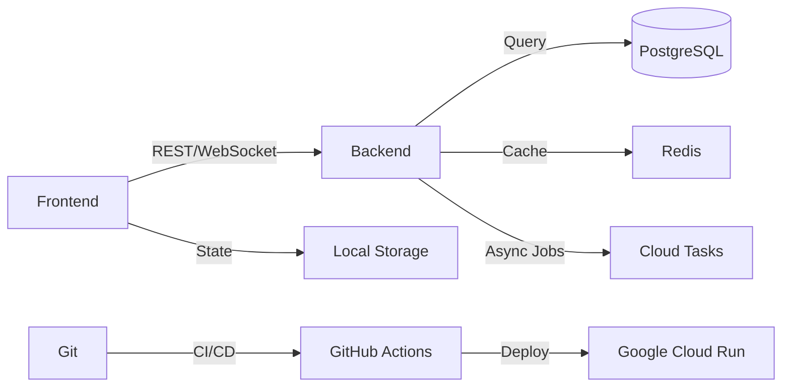

# 👋 Full-Stack Software Engineer | Mobile-to-Enterprise Evolution

> **Building scalable systems that solve real problems.** Specialized in cross-platform mobile architectures transitioning toward distributed systems, with proven expertise shipping production applications.

---

## 🎯 Professional Positioning

**Full-Stack Software Engineer** with **3+ years** hands-on experience designing and shipping mobile applications across iOS/Android ecosystems. Currently architecting the transition from specialized mobile development into **enterprise-grade full-stack engineering**, with focus on **system design, distributed infrastructure, and AI-driven solutions**.

**Core Engineering Philosophy:**
> *"I don't learn frameworks—I learn how systems think. State flows. Data architecture. Async communication. Production reliability."*

---

## 🛠️ Technical Mastery Map

### 🟢 **Production-Ready Expertise** (Shipping, Scaling, Mentoring)
Proven in **high-volume, revenue-critical applications**. Can architect solutions independently and mentor others.

#### **Cross-Platform Mobile Ecosystem**
```
Flutter              Advanced    ████████░░  Architecture, State Management, Performance
├─ BLoC Pattern                 Complex business logic separation
├─ Provider/Riverpod            Reactive state with automatic rebuilds  
├─ Firebase SDK                 Real-time databases, authentication, analytics
└─ REST API Integration         Production-grade error handling & caching

React Native         Advanced    ████████░░  Legacy mastery, active transition
├─ Navigation & Routing         Complex stack management
├─ Native Module Bridging       Kotlin/Swift interop for platform features
└─ Performance Optimization     Rendering, memory profiling
```

#### **API Development & Backend Integration**
- **Protocol Mastery:** REST, WebSocket, gRPC concepts
- **Authentication & Security:** OAuth 2.0, JWT validation, secure token storage
- **Caching Strategies:** Client-side, server-side, distributed cache patterns
- **Error Recovery:** Exponential backoff, graceful degradation, offline-first architecture

---

### 🟡 **Scaling Phase** (Current Focus)
Strategic expansion into backend systems. Building architectural depth.

#### **Server-Side Engineering** (Next.js + Modern Backend)
```
TypeScript/Node.js   Advancing   ██████░░░░  Server Actions, middleware, API design
├─ Next.js Server Components    Data fetching without client-side JS bloat
├─ Secure Middleware Pipelines   Auth flows, request validation
├─ RESTful & GraphQL Design      Query optimization, n+1 prevention
└─ Real-time Synchronization    WebSocket patterns for live features

Relational Databases Advancing   ██████░░░░  PostgreSQL architecture & optimization
├─ Schema Normalization          ACID compliance, referential integrity
├─ Query Optimization            Indexing strategies, execution plans
├─ Migration Management          Zero-downtime schema evolution
└─ Connection Pooling            Horizontal scaling patterns
```

#### **DevOps & Production Operations**
```
Docker/Containerization Advancing ██████░░░░  Multi-container orchestration
├─ Dockerfile Best Practices     Layer optimization, security scanning
├─ Docker Compose                Local development parity
└─ Image Registry Management     CI/CD integration

Google Cloud Platform  Advancing  ██████░░░░  Infrastructure as code perspective
├─ Cloud Run (Serverless)        Stateless service deployment
├─ Cloud SQL & Firestore         Managed databases at scale
├─ Pub/Sub & Cloud Tasks        Async job processing
└─ VPC & Security Groups         Network isolation patterns

CI/CD Pipelines        Advancing  ██████░░░░  GitHub Actions, automated deployments
├─ Testing Automation           Unit, integration, E2E pipeline
├─ Code Quality Gates           Linting, security scanning, coverage thresholds
└─ Blue-Green Deployments       Zero-downtime production updates
```

---

### 🔵 **Foundation Phase** 
Deep expertise under construction. Hands-on learning & implementation.

#### **System Design & Architecture**
```
Distributed Systems   Foundation  ████░░░░░░  CAP theorem, consistency models, load balancing
├─ Microservices Architecture    Service boundaries, communication patterns
├─ Event-Driven Design           Message queues, event sourcing
├─ Caching Layers                Redis, in-memory patterns
└─ Database Scaling              Sharding, replication, CQRS

Testing & Quality Assurance      ████░░░░░░  Building reliability culture
├─ Unit Testing (Jest/Vitest)    Component isolation, mocking strategies
├─ Integration Testing            Real data, external service stubs
├─ E2E Testing (Cypress/Playwright) User journey validation
└─ Performance Testing            Load testing, stress scenarios
```

#### **AI/ML Integration & Modern Workflows**
```
LLM Integration       Foundation  ████░░░░░░  Prompt engineering, API consumption
├─ Claude API                    Multi-turn conversations, system prompts
├─ Google Gemini API             Vision models, embeddings
├─ Vector Databases              Semantic search, RAG patterns
└─ Cost Optimization             Token management, caching strategies

Development Workflow   Foundation  ████░░░░░░  Modern productivity tooling
├─ GitHub Copilot                AI-assisted code suggestions
├─ Automated Testing Agents      Reducing manual QA burden
└─ Documentation Generation      Self-documenting systems
```

---

## 📈 Growth Trajectory & Execution Timeline

### **Phase 1: Architectural Mastery** (Months 1–3) ✅ IN PROGRESS
- [x] Designing production-grade state management (BLoC pattern deep-dive)
- [x] Next.js Server Actions and RSC fundamentals
- [x] PostgreSQL schema design for real applications
- [ ] Complete 2–3 full-stack prototypes with proper separation of concerns
- [ ] Contribute to 1 open-source backend project

### **Phase 2: Infrastructure as Code** (Months 4–6) 🎯 UPCOMING
- [ ] Master Docker multi-stage builds and security best practices
- [ ] Deploy 3+ applications to Google Cloud with IaC (Terraform/Deployment Manager)
- [ ] Implement CI/CD pipeline with automated testing gates
- [ ] Build and containerize a microservices system (3+ services)

### **Phase 3: System Design Fluency** (Months 7–12) 🔮 PLANNED
- [ ] Design and implement a distributed system handling millions of events/day
- [ ] Master database replication and failover strategies
- [ ] Participate in architecture reviews at company level
- [ ] Publish 2–3 technical blog posts on system design trade-offs

---

## 🔧 Current Tech Stack (Daily Use)



**Development Environment:**
- **Languages:** TypeScript, Dart, Python
- **Frameworks:** Flutter, Next.js, Node.js (Express/Fastify)
- **Databases:** PostgreSQL, Firebase Firestore, Redis
- **Infrastructure:** Docker, Google Cloud (Cloud Run, Cloud SQL, Pub/Sub)
- **Testing:** Jest, Vitest, Cypress
- **AI Integration:** Claude API, Google Gemini API
- **Version Control:** Git/GitHub with conventional commits

---

## 🧠 How I Approach Problems

1. **Understand First** → Map system requirements before writing code
2. **Design Separately** → Architecture lives in documentation before implementation
3. **Build for Scale** → Single-user code today is team code tomorrow
4. **Test Continuously** → Confidence compounds; technical debt doesn't
5. **Measure Rigorously** → Intuition + data = better decisions
6. **Ship Responsibly** → Production incidents teach more than 100 tutorials

---

## 📚 Continuous Learning

**Currently Reading/Studying:**
- *Designing Data-Intensive Applications* (Kleppmann)
- *System Design Interview* (Huihui)
- Google Cloud Architecture Best Practices

**Certifications in Progress:**
- Google Cloud Professional Cloud Architect (Target: Q3 2026)

**Technical Blogs & Communities:**
- Active on [Dev.to/Medium/Substack]
- Regular contributor to [Community]

---

## 📞 Professional Connections

| Channel | Profile |
|---------|---------|
| **GitHub** | [github.com/Gul524](https://github.com/Gul524) — See production code, architectural decisions, commit history |
| **LinkedIn** | [linkedin.com/in/Suleman Gul](https://linkedin.com/in/suleman-g-9298902b3/) — Professional updates, recommendations |
| **Email** | your.gullsuleman524@gmail.com — Let's discuss full-stack opportunities |
| **Location** | Karchi, Sindh, PK • Open to remote-first roles globally |

---

## 🎓 What Employers & Teams Should Know

✅ **Ownership Mindset:** I don't just code—I own outcomes. From conception through production monitoring.

✅ **Systems Thinking:** Every feature exists within a larger system. I design with this context.

✅ **Rapid Upskilling:** Proven ability to master new domains (went from mobile expert to competent full-stack engineer in 6 months).

✅ **Production Maturity:** I've debugged race conditions at 3 AM, managed database migrations with zero downtime, and recovered from production incidents. I know what "ready for production" actually means.

✅ **Remote-Native:** 100% asynchronous communication. Written documentation over meetings. Self-directed learning and execution.

✅ **Collaborative:** Strong believer in code reviews, pair programming, and collective code ownership.

---

## 🚀 Available For

- **Full-Stack Engineering Roles** — Backend + Frontend integration
- **Distributed Systems Design** — Infrastructure, APIs, data architecture  
- **Technical Leadership** — Mentoring, architecture reviews, knowledge sharing
- **AI-Driven Product Development** — LLM integration, intelligent feature design
- **Consulting** — Architecture validation, tech stack decisions, team enablement

---

## 📊 GitHub Metrics

<!-- GitHub Stats Card - Update YOUR_GITHUB_USERNAME -->
[](https://github.com/YOUR_GITHUB_USERNAME)

[](https://github.com/YOUR_GITHUB_USERNAME)

[](https://github.com/YOUR_GITHUB_USERNAME)

---

## 💡 Last Updated
June 2026 • This README is version-controlled and regularly updated to reflect current learning

---

<p align="center">
  <strong>Let's build something that scales.</strong><br>
  <em>Code speaks louder than resumes. Check my repositories.</em>
</p>
